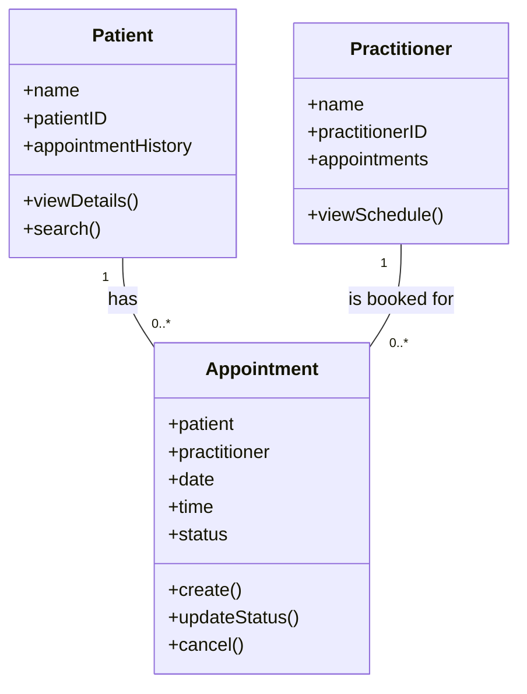

# SmartCare Domain Model (Stage 3 / v0.3)

## Part A – Requirements Review

### Nouns (candidate classes)
- Patient
- Practitioner
- Appointment

### Verbs (behaviours)
- Create and view patient records
- Search for patient information
- Book an appointment
- Update appointment status
- Cancel an appointment

### Business rules
- A practitioner cannot have two appointments at the same date and time.
- An appointment needs a patient, practitioner and appointment time before it can be created.

## Part B – Candidate Classes

| Candidate concept | Supporting requirement | State (attributes) | Behaviour (methods) |
|---|---|---|---|
| Patient | FR-01, FR-02, FR-08 | Patient name, patient ID, appointment history | Create, search and view patient information |
| Practitioner | FR-03, FR-04, FR-05 | Practitioner name, practitioner ID, appointments | Create and view practitioner information and appointments |
| Appointment | FR-04, FR-05, FR-06, FR-07, FR-09, FR-10 | Patient, practitioner, date, time, status | Create, view, update and cancel appointments |

## Part C – CRC Cards

### Patient
- Responsibilities: Knows the patient's name, ID and appointment history; can store and provide patient information.
- Collaborators: Appointment

### Practitioner
- Responsibilities: Knows the practitioner's name, ID and scheduled appointments; can provide practitioner information.
- Collaborators: Appointment

### Appointment
- Responsibilities: Knows the patient, practitioner, date, time and status; can be created, updated and cancelled.
- Collaborators: Patient, Practitioner

## Part D – UML Class Diagram

The two lines at the bottom mean:

- Patient 1 → 0 Appointments: one patient can have no appointments or many appointments.
- Practitioner 1 → 0 Appointments: one practitioner can have no appointments or many appointments.
- Each Appointment is connected to one patient and one practitioner.

## Design Rationale

The system primarily keeps track of three main entities (Patient, Practitioner and Appointment), which is why the design was based on these. The Appointment class connects the patient and the practitioner, as that is where the appointment's time, date and status are stored. As there could be many appointments for one patient, and likewise for one practitioner over time, I used a one-to-many relationship in the UML class diagram.