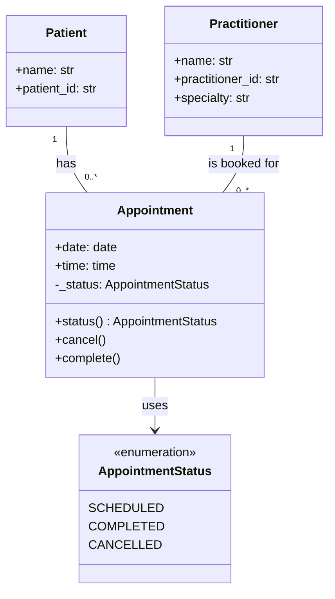

# SmartCare v0.4 – Domain Implementation Workbook

## Part A – Approved UML (confirmed before coding)
The implementation follows the approved Stage 3 UML: Patient (name, ID), Practitioner (name, ID) and Appointment (date, time, status), with one-to-many relationships between Patient/Practitioner and Appointment. As required by the Stage 4 lab (Part C), Practitioner also stores a specialty. This is recorded as a design change in section 5.

## 1. UML-to-Code Trace

| UML element | Python element | Implemented? | Notes |
|---|---|---|---|
| Patient (name, ID) | Patient class | Yes | Type hints + validation for empty name/ID |
| Practitioner (name, ID) | Practitioner class | Yes | Adds specialty (Stage 4 Part C); no database logic |
| Appointment (date, time, status) | Appointment dataclass | Yes | Uses AppointmentStatus enum |
| Status attribute | AppointmentStatus enum + read-only `status` property | Yes | SCHEDULED, COMPLETED, CANCELLED |
| One-to-many relationships | Patient and Practitioner passed into Appointment | Yes | Appointment links a Patient and a Practitioner |

## 2. Domain Invariants

| Class | Invariant / rule | How protected |
|---|---|---|
| Patient | Name and ID cannot be empty | ValueError raised in `__init__` |
| Practitioner | Name and ID cannot be empty | ValueError raised in `__init__` |
| Appointment | Must have patient, practitioner, date and time | ValueError raised in `__post_init__` |
| Appointment | A practitioner cannot be double-booked | Class-level `_booked_slots` registry checks the slot |
| Appointment | Status changes only via methods, not direct assignment | Status stored as private `_status`; `status` is a read-only property; only `cancel()` and `complete()` change it |
| Appointment | A cancelled appointment cannot be cancelled again or reactivated; a completed appointment cannot be cancelled | `cancel()`/`complete()` raise ValueError on illegal transitions |
| Appointment | A cancelled slot becomes available again | `cancel()` removes the slot from `_booked_slots` |

## 3. Composition / Inheritance Decisions

| Relationship | Decision | Rationale |
|---|---|---|
| Appointment – Patient | Composition / association | An appointment *has* a patient; it is not a type of patient |
| Appointment – Practitioner | Composition / association | An appointment *has* a practitioner; not inheritance |
| Appointment – PatientRecord | No inheritance | Appointment is not a kind of patient record; inheritance would be wrong |

## 4. AI Pair-Programming Record

| AI contribution | Conforms? | Decision | Reason | Verification |
|---|---|---|---|---|
| Appointment dataclass with patient, practitioner, date, time, status | Yes | Accepted | Matches the approved UML | Check 1 creates a valid appointment |
| AppointmentStatus enum | Yes | Accepted | Required by the prompt; gives a fixed set of statuses | Status prints as `AppointmentStatus.SCHEDULED` |
| `from future import annotations` | No – bug | Modified | Should be `from __future__ import annotations`; would crash | File runs without errors |
| `def post_init` | No – bug | Modified | Should be `__post_init__`, or validation never runs | Check 2 and check 6 show validation runs |
| Public `status` field | No | Modified | Any code could set status directly and bypass the transition rules | Check 5: direct status change rejected |
| `cancel()` did not free the booked slot | No | Modified | A cancelled time could never be rebooked | Check 7: cancelled slot rebooked |
| Extra `complete()` method | Partly – not in UML | Accepted with note | Makes COMPLETED a terminal state without adding a class | Check 8: cancel after complete rejected |
| Class-level `_booked_slots` registry for double-booking | Yes | Accepted | Enforces the FR-05 business rule | Check 6: double-booking rejected |

## Part E – Review of AI-Generated Code (Appointment)

| Check | Finding | Action |
|---|---|---|
| Model consistency | Appointment matches the UML (patient, practitioner, date, time, status) | Accepted |
| Bug: `from future import annotations` | Should be `from __future__ import annotations` – would crash | Fixed |
| Bug: `def post_init` | Should be `__post_init__`, or validation never runs | Fixed |
| Public state mutation | `status` was a public field, so `appt.status = ...` bypassed `cancel()`/`complete()` | Fixed – made `_status` private with a read-only `status` property |
| Unnecessary inheritance | None added | Good |
| Invented dependencies | No database/UI/notification/service classes added | Good |
| Error handling | Raises ValueError for invalid input and illegal transitions | Good, kept |
| Cancelled slot not released | `cancel()` left the slot in `_booked_slots`, blocking rebooking | Fixed – `cancel()` now frees the slot |
| Extra `complete()` method | Added beyond the UML; AI justified it as making COMPLETED terminal | Accepted with note |

## Part G – Refactor
After reviewing the AI-generated Appointment class, I fixed two bugs (`__future__` import and `__post_init__` method name) so validation and conflict-checking actually run. On further review I found that `status` could still be set directly, so I made it a private `_status` with a read-only `status` property. I also made `cancel()` free the booked slot so a cancelled time can be rebooked. I replaced the `Any` type hints with `Patient` and `Practitioner` and removed the unused import. No unnecessary classes or dependencies were added. The final implementation stays consistent with the approved UML: three focused classes, type hints, validation, and protected status transitions.

## 5. Updated UML

Implementation revealed three justified design changes:

1. **Practitioner.specialty** – required by the Stage 4 lab (Part C); stored as a simple attribute.
2. **AppointmentStatus enum** – replaces the untyped `status` attribute so only valid statuses can exist.
3. **Appointment.complete()** – added by AI and accepted, so an appointment can reach the COMPLETED state.



## Verification Evidence (output of test_checks.py)

```
Created appointment with status: AppointmentStatus.SCHEDULED
Invalid patient rejected: Patient name cannot be empty
After cancel, status: AppointmentStatus.CANCELLED
Illegal repeated cancel rejected: A cancelled appointment cannot be cancelled again.
Direct status change rejected: status is read-only
Double-booking rejected: The practitioner already has an appointment at this date and time.
Cancelled slot rebooked with status: AppointmentStatus.SCHEDULED
After complete, status: AppointmentStatus.COMPLETED
Cancel after complete rejected: A completed appointment cannot be cancelled.
```